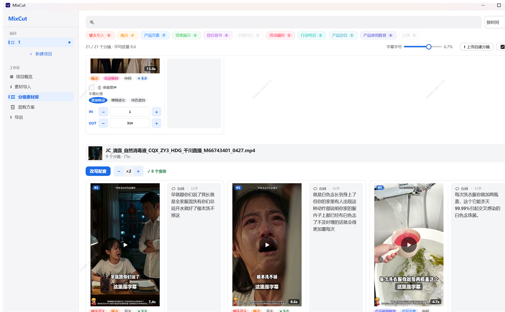
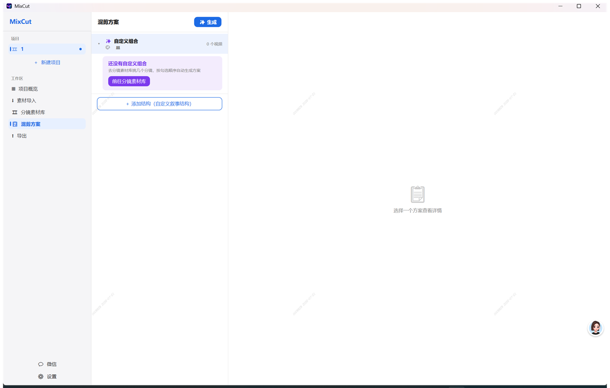
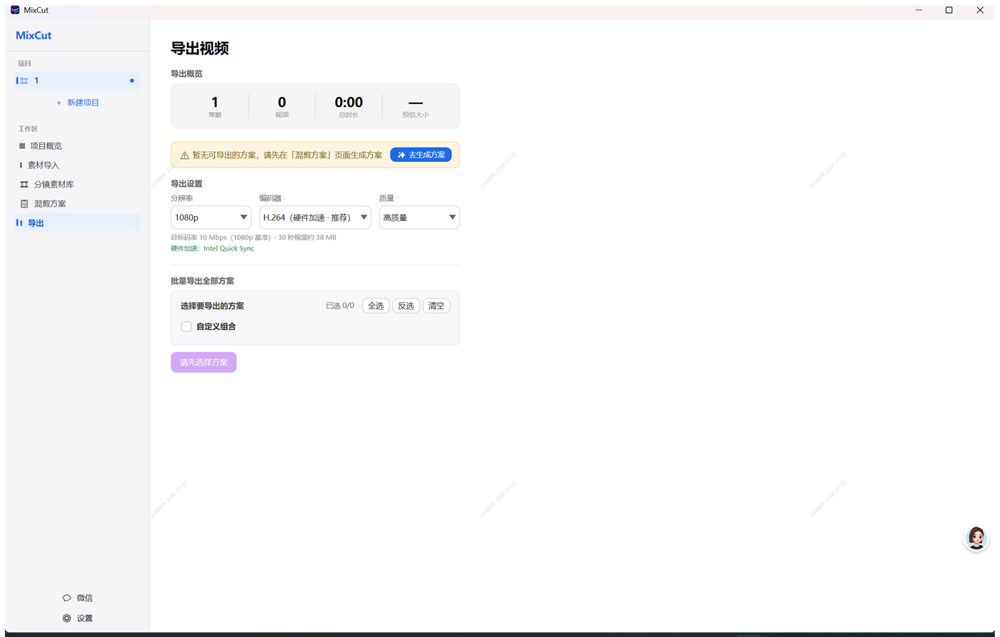
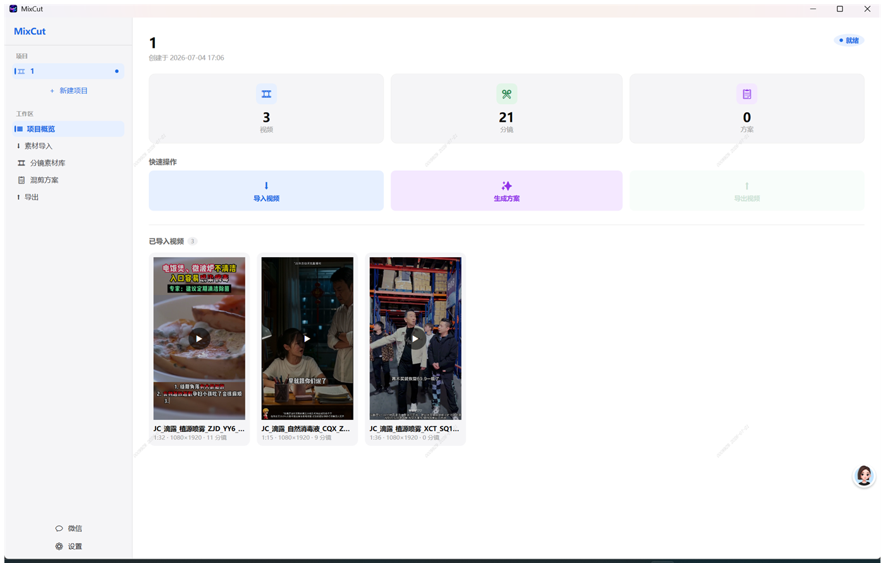
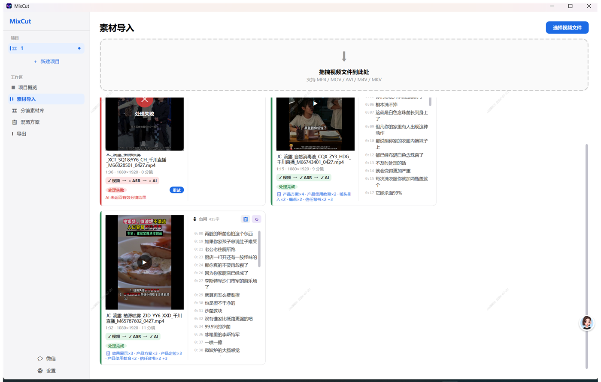

<div align="center">


# MixCut for Windows

**AI 广告视频混剪工具 · Windows 原生 · 装上即用**

把一堆投放素材丢进去，AI 自动切分镜、排列组合、改写口播、克隆原声、烧录字幕，一键批量出几十条差异化广告。

[](https://github.com/RoshanGH/mixcut-windows/releases)
[](#-下载)
[](#-技术架构)
[](https://github.com/RoshanGH/mixcut-windows/stargazers)

[**⬇️ 下载**](#-下载) · [**✨ 功能**](#-功能亮点) · [**🚀 快速开始**](#-快速开始) · [**🛠 技术架构**](#-技术架构) · [**🍎 macOS 版**](https://github.com/RoshanGH/mixed_cut)

</div>

<div align="center">
  
</div>

---

## 这是什么

**面向广告投放团队的 Windows 桌面应用。** 你把广告素材导进来，它用本地信号提取 + 云端 AI 语义决策，把视频拆成一个个带类型标注的分镜，然后帮你：

- 🎬 **智能混剪** —— AI 出策略 → 按策略排列分镜组合 → 一键批量导出多条差异化广告
- 🗣️ **AI 配音 / 口播替换** —— 改写台词 → 克隆原视频说话人音色 → 合成配音 → 保留原 BGM → 逐句烧录字幕
- 🖼️ **分镜头 AI 画面替换** —— 把一个分镜切成物理镜头，对单个镜头用提示词换画面（换背景 / 换主体 / 换颜色）

> 🔒 **视频不出本机** —— 视频内容与 API Key 全部本地处理，AI 调用只发送结构化文本，从不上传你的视频。
> 📦 **零依赖** —— FFmpeg / Whisper / 人声分离模型全部内置，不用装 .NET、VC++、编解码器，双击即用。
> 🪟 **Windows 10 / 11 双平台**，x64。

---

## 📥 下载

| 渠道 | 链接 | 说明 |
|------|------|------|
| **下载页（推荐）** | [**47.119.175.47/mixcut/**](http://47.119.175.47/mixcut/) | 国内直连，macOS / Windows 都在这里 |
| GitHub Releases | [Releases](https://github.com/RoshanGH/mixcut-windows/releases) | 版本说明与更新日志 |
| Gitee（国内镜像） | [Releases](https://gitee.com/jinxiushanhehao/mixcut-windows/releases) | |

下载 `MixCut-Setup-vX.Y.Z-win-x64.exe` → 双击 → 一路下一步 → 完成即用。**无需管理员权限**。

> 安装包约 1.8 GB，因为把 FFmpeg、Whisper 语音识别、人声分离模型全都打包进去了 —— 换来的是装完不用配任何环境。
> 首次启动若被 SmartScreen 拦截，点「更多信息 → 仍要运行」（应用未做代码签名，后续会补）。

---

## ✨ 功能亮点

### 🤖 AI 智能混剪

- **AI 语义切分** —— 自动识别 11 种语义类型（噱头引入 / 痛点 / 产品方案 / 效果展示 / 信任背书 / 价格对比 / 活动福利 / 行动号召 / 产品定位 / 产品使用教育 / 过渡）
- **两步生成方案** —— ① AI 出策略（风格 / 受众 / 叙事结构）② AI 按策略排列分镜组合，一次产出多条差异化广告
- **混合语音识别** —— 内置 whisper.cpp 离线出字级时间戳；再用阿里 Paraformer 逐分镜精识别（短音频更准、自带标点）
- **多 AI 提供商** —— 千问 / MiniMax / DeepSeek / Claude / 国内转发网关 / 任意 OpenAI 兼容接口

<div align="center"></div>

### 🗣️ AI 配音与逐句字幕

- **台词裂变** —— 给每个分镜 AI 改写出多套差异化台词（默认 2 套，可调 1–5）
- **逐分镜声音克隆** —— 用视频里的原声克隆音色再合成配音。**每个分镜单独克隆**：广告常「开头换人带货」，逐分镜克隆避免串音串性别
- **人声 / BGM 分离** —— 内置 demucs 分离人声与背景乐，配音成片保留原视频 BGM，只替换人声
- **逐句字幕** —— 字幕跟着人声一句一句出现；可试听每句、±0.1s 调时间、手动拆句、一键重新自动对齐
- **字幕处理三选一** —— 直接烧录 / 模糊虚化 / 纯色遮挡（盖住旧字幕再烧新的），字号无级可调、所见即所得

### 🎞️ 视频处理与导出

- **自带 FFmpeg 解码栈** —— 预览、缩略图、导出**同源**走内置 FFmpeg。HEVC / iPhone「高效」格式无需系统编解码器也能预览，从根上杜绝「能预览不能导 / 能导不能预览」
- **硬件加速** —— 启动探测编码器，优先 NVIDIA NVENC / Intel QSV / AMD AMF，CPU 兜底
- **配音组合导出** —— 每个分镜的「原声 + 各改写版」按组合批量出片，一次产出大量差异化成片
- **第一帧不黑屏** —— 帧精确切片（trim + setpts），封面/首帧立即有画面
- **视频全局共享** —— 同一视频（SHA-256 哈希）跨项目共享，导入已分析过的视频秒级完成

<div align="center"></div>

### ✨ 顺手的细节

- **剪映式逐帧预览** —— 点击缩略图即时播放；调分镜 IN/OUT 边界（±1 帧）时画面实时跟到那一帧
- **可点击撤销** —— 删除类操作弹出「撤销」按钮，与 `Ctrl+Z` 同一条恢复路径
- **人话报错** —— 免费额度用完、欠费、未开通模型权限、磁盘满、文件被占用……分别给准确中文提示 + 下一步指引，绝不把英文错误码甩给用户
- **失败可重试** —— 批量导出失败后可「只重试失败的 N 个」，不重复导已成功的
- **状态自愈** —— 强退后下次启动自动重置卡在「分析中 / 生成中」的状态；已提交的付费 AI 任务重启后可凭 taskId 免费取回结果

---

## 🖥️ 界面一览

| 项目概览 | 素材导入 |
|:---:|:---:|
|  |  |
| **混剪方案** | **批量导出** |
|  |  |

> 素材统一按 **9:16 竖屏**处理（面向手机端信息流广告）。

---

## 🚀 快速开始

**1. 安装** —— 从[下载页](http://47.119.175.47/mixcut/)拿安装包，双击装完即用。

**2. 填 API Key** —— 打开「设置 → AI 模型」：

| 提供商 | 说明 |
|--------|------|
| **千问 (Qwen)** | 阿里通义千问。**AI 配音（声音克隆 + 合成）与画面替换依赖它** |
| **MiniMax** / **DeepSeek** / **Claude** | 各家官方 API |
| **国内转发网关** | 转发到 Claude / Gemini / OpenAI |
| **自定义** | 任意 OpenAI 兼容接口（自填地址 + 模型名） |

> AI 切分与混剪方案可用上述任一家；**AI 配音**需要千问（阿里百炼）并开通 `qwen-voice-enrollment`（声音克隆）与 `qwen3-tts-vc`（音色合成）。

**3. 走一遍流程** —— 新建项目 → 导入视频（自动 AI 分析）→ 分镜素材库查看/微调 → 生成混剪方案 → 导出。

**系统要求**：Windows 10（1809 / 17763 及以上）或 Windows 11，x64。首次使用语音识别时自动下载 Whisper 模型（约 1.5 GB，仅一次，走国内镜像源、支持断点续传）。

---

## 🛠 技术架构

C# + WPF + .NET 8，MVVM。设计上把「精确信号提取」和「语义决策」分开——所有视觉/音频信号由本地 FFmpeg / Whisper 精确提取成结构化数据，再交给 AI 做语义决策，**不把视频喂给 AI**。

```
WPF Views  →  ViewModels (CommunityToolkit.Mvvm)  →  Service Layer (async/await)
                                                       ├─ 场景检测 / ASR(whisper+paraformer) / AI 语义分析
                                                       ├─ 方案生成 / 导出 / 配音导出
                                                       └─ 声音克隆 / 人声分离(demucs) / 边界优化
EF Core 8 + SQLite  ·  内置 FFmpeg / whisper.cpp / demucs  ·  Serilog 结构化日志
```

**几个值得一看的处理**

- **自带解码栈，与系统解耦** —— 预览/缩略图/导出共用内置 FFmpeg，不依赖系统编解码器，也就没有「这台机器能播那台不能」
- **进程不孤儿** —— 所有 whisper / ffmpeg / demucs 子进程挂 Windows Job Object，主进程退出一起回收
- **付费 API 的计费安全** —— 异步任务提交成功即落库 taskId，崩溃重启后凭同一 taskId 免费取回结果，不重复扣费
- **错误翻译器** —— 底层异常按真因分类（内存不足 / 超时 / 编解码器崩溃 / 磁盘满 / 文件被占用…）翻成人话 + 下一步，技术细节只进日志

**本地构建**

```powershell
git clone https://github.com/RoshanGH/mixcut-windows.git
cd mixcut-windows

# 内置二进制需自行放入 src/MixCut/Resources/bin/
#   ffmpeg.exe / ffprobe.exe / whisper-cli.exe / demucs.exe
#   + 6 个 VC Runtime DLL + vcomp140.dll（详见 CLAUDE.md）

# 构建（这几个参数是必须的，见下方说明）
dotnet build src\MixCut\MixCut.csproj -c Release -nodeReuse:false -p:UseSharedCompilation=false
```

> ⚠️ **构建必须带 `-nodeReuse:false -p:UseSharedCompilation=false`**。WPF 的 `GenerateTemporaryTargetAssembly` 会生成临时工程并递归调用 MSBuild，撞上被复用且状态污染的 MSBuild 节点会**死锁**（表现为构建卡住不动）。禁掉节点复用即可稳定在 20 秒左右完成。

架构细节、开发规范与踩坑沉淀见 [`CLAUDE.md`](./CLAUDE.md)。

---

## 🔧 故障排查

| 症状 | 原因 | 解决 |
|---|---|---|
| 「Windows 已保护你的电脑」蓝色弹窗 | SmartScreen 拦截未签名应用 | 点「更多信息 → 仍要运行」，之后不再弹 |
| 双击没反应 / 一闪而过 | 启动期崩溃 | 查 `%APPDATA%\MixCut\logs\mixcut-*.log`，搜 `[FTL]` / `[ERR]` |
| 杀软拦截 `whisper-cli.exe` / `ffmpeg.exe` | 未签名 EXE 被误报 | 把 MixCut 安装目录加入白名单 |
| 语音识别失败、提示 CPU 不支持 | 内置 whisper 需要 AVX2 | Intel < Haswell(2013) / AMD < Excavator(2015) 的老 CPU 跑不了，其它功能仍可用 |
| AI 报「免费额度已用完」/「未开通模型权限」 | 所选模型额度耗尽或未开通 | 去阿里百炼控制台开通付费；配音克隆需 `qwen-voice-enrollment` + `qwen3-tts-vc` |

**一键收集诊断信息**：应用内「设置 → 关于 → 导出诊断日志」，会在桌面生成 zip（日志已自动脱敏，不含 API Key）。

---

## 🙏 致谢

[whisper.cpp](https://github.com/ggerganov/whisper.cpp) · [demucs](https://github.com/facebookresearch/demucs) · [FFmpeg](https://ffmpeg.org/) · [CommunityToolkit.Mvvm](https://github.com/CommunityToolkit/dotnet) · [NAudio](https://github.com/naudio/NAudio) · [Serilog](https://serilog.net/)

## 📮 联系 & 反馈

- **开发者**：MengGang · [@RoshanGH](https://github.com/RoshanGH)
- **问题反馈**：[GitHub Issues](https://github.com/RoshanGH/mixcut-windows/issues)
- **macOS 版**：[RoshanGH/mixed_cut](https://github.com/RoshanGH/mixed_cut)

如果 MixCut 帮你省下了剪片子的时间，欢迎点个 ⭐ Star！

## License

暂未开源授权（保留所有权利）。如需商用或二次开发请先联系作者。
